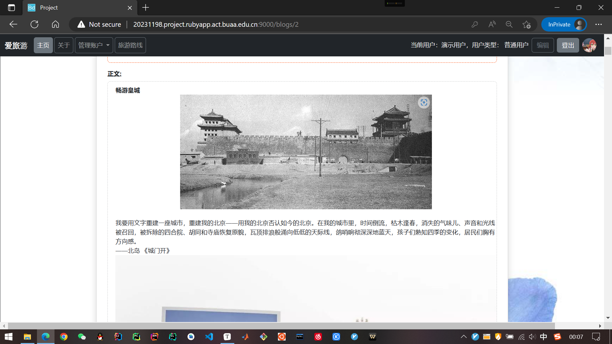
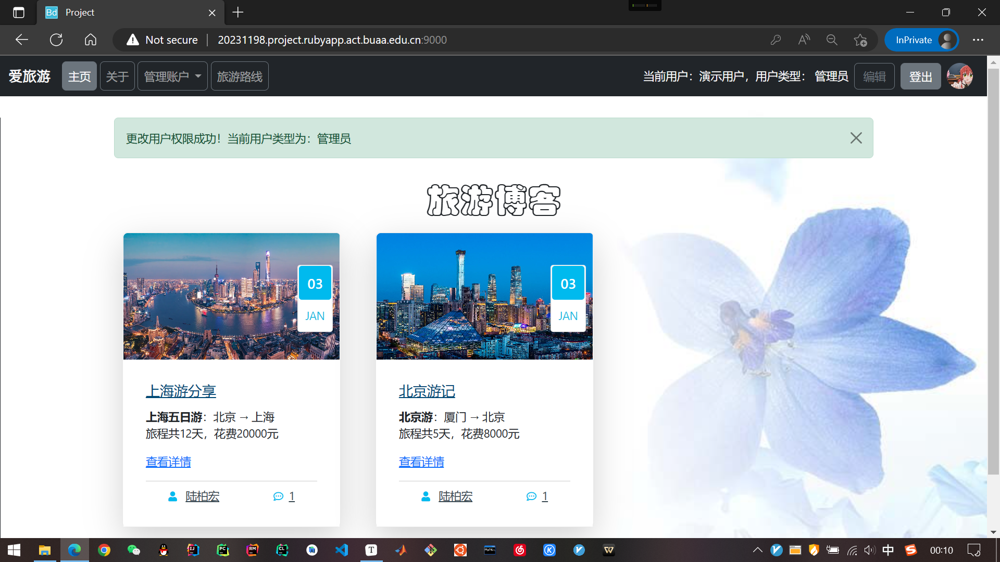
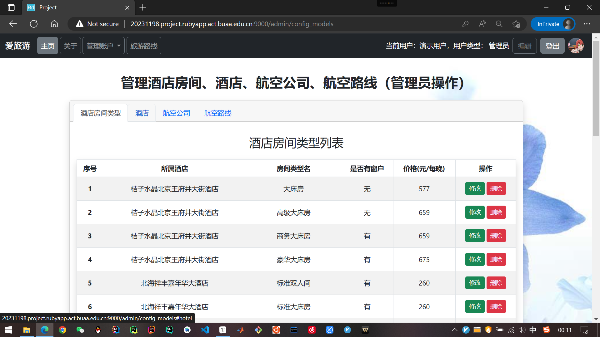
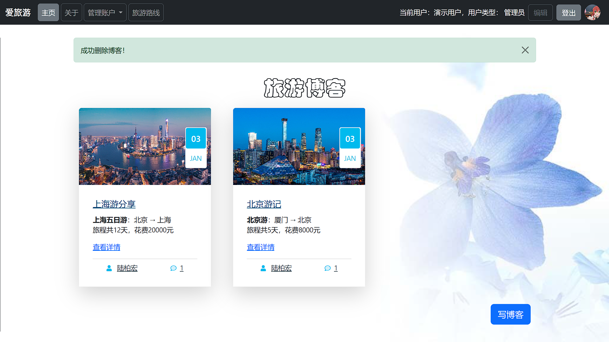

# BUAA-Rails-Blog-App

[中文版](./README_zh.md)

This project is a web application built using the Ruby on Rails framework for sharing travel blog posts. Additionally, it serves as a major assignment for the Ruby language programming course at Beihang University.

## Requirements

- Operating System: Windows 10 or Ubuntu 20.04
- Ruby Version: 3.1.2
- Rails Version: 7.0.4
- sqlite3 Version: 1.4
- Yarn Version: 1.22.19
- Node.js Version: 16.17.1
- For more specific dependencies, refer to `Gemfile`

## Getting Started

- Clone the repository from GitHub:

  ```shell
  git clone https://github.com/NormalLLer/BUAA-Rails-Blog-App.git
  cd ./BUAA-Rails-Blog-App
  ```

- Run the following command in the project root directory:

  ```ruby
  bundle install
  ```

- Build the database:

  ```ruby
  rails db:migrate
  ```

- Insert initial data (optional):

  ```ruby
  rails db:init_data
  ```

- Yarn configuration:

  ```ruby
  yarn install  # If encountering issues, try: yarn install --ignore-engines
  yarn build:css
  ```

> Note: The above steps only need to be executed once. For subsequent project launches, only the following commands need to be executed.

- Start the project:

  ```ruby
  # Local launch
  rails s
  ```

  Access [https://localhost:3000](https://localhost:3000/), and for subsequent runs, simply execute `rails s`.

#  BUAA-Rails-Blog-App

This project is a web application built using the Ruby on Rails framework for sharing travel blog posts. Additionally, it serves as a major assignment for the Ruby language programming course at Beihang University.

## Requirements

- Operating System: Windows 10 or Ubuntu 20.04
- Ruby Version: 3.1.2
- Rails Version: 7.0.4
- sqlite3 Version: 1.4
- Yarn Version: 1.22.19
- Node.js Version: 16.17.1
- For more specific dependencies, refer to `Gemfile`

## Getting Started

- Clone the repository from GitHub:

  ```
  shellCopy codegit clone https://github.com/NormalLLer/BUAA-Rails-Blog-App.git
  cd ./BUAA-Rails-Blog-App
  ```

- Run the following command in the project root directory:

  ```
  rubyCopy code
  bundle install
  ```

- Build the database:

  ```
  rubyCopy code
  rails db:migrate
  ```

- Insert initial data (optional):

  ```
  rubyCopy code
  rails db:init_data
  ```

- Yarn configuration:

  ```
  rubyCopy codeyarn install  # If encountering issues, try: yarn install --ignore-engines
  yarn build:css
  ```

> Note: The above steps only need to be executed once. For subsequent project launches, only the following commands need to be executed.

- Start the project:

  ```
  rubyCopy code# Local launch
  rails s
  ```

  Access [https://localhost:3000](https://localhost:3000/), and for subsequent runs, simply execute `rails s`.

## Project Description

### Registration and Login

The homepage is:


Click on the register button in the upper right corner to register an account:


After clicking on the register button, you will be automatically logged in and redirected to the main page you were accessing:


### Blog Viewing and Demonstration

After opening a blog, you can see the following page:





After posting a comment:


This comment can be deleted.

### Modify Personal Information Page


### User Permission Modification Page

> Since creating entities for Hotel, Hotel Room, Airline Company, and Airline Route requires administrator permissions, this page is provided to modify user permissions. Only for testing purposes.


Change this user to an administrator:



### View Registered Users (Admin)


You can click on "Delete Account" to delete a user.

### Hotel Room, Hotel, Airline Company, and Airline Route Management (Admin)

Manage these four data models. Among them:

- When creating a hotel room type, you must specify its corresponding hotel.
- When creating an airline route, you must specify the airline company it belongs to.
- In other words, there is a one-to-many relationship between Hotel and Room Type, and between Airline Company and Airline Route.




The above screenshots show the Hotel Room Type page, and the others are similar.

### Travel Routes

Add a travel route:


After adding, it can be viewed:


Here, the travel route has a one-to-many relationship with both the hotel and airline routes.

### Blog Operations

Create a new blog:


After successful creation:


Delete a blog:

